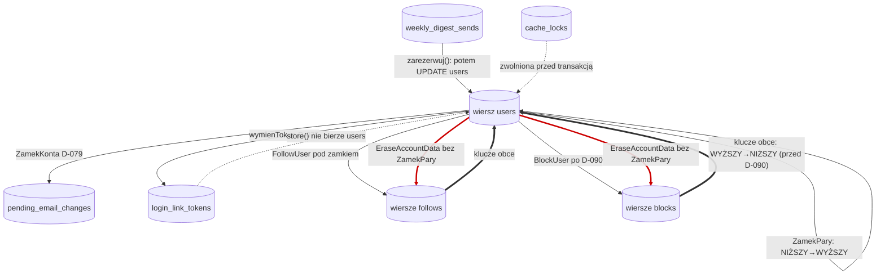

# Kolejność blokad w pięciu mechanizmach z 10.09.2026 — audyt

**Data:** 10 września 2026 · **Zakres:** D-075, D-076, D-077, D-079, D-080, D-081
**Charakter:** analiza. Jedna naprawa (D-090) została wdrożona na wyraźne
rozszerzenie zakresu; wszystkie pozostałe naprawy są **opisane, nie wdrożone**.

---

## 1. Dlaczego ten dokument istnieje

Dokument przekazania pracy nazwał to największą znaną dziurą w pewności co do
sesji 10.09.2026:

> Dziś wjechało pięć nowych, niezależnie napisanych mechanizmów blokowania.
> Pisało je pięć osób, z których żadna nie widziała pozostałych. Żaden test
> w tym repozytorium nie chodzi na dwóch połączeniach do PostgreSQL
> (`RefreshDatabase` trzyma dane w niezatwierdzonej transakcji), więc
> **zakleszczenia i inwersje kolejności blokad są niewidoczne**.

To zdanie jest prawdziwe i jest powodem, dla którego **cały ten audyt został
wykonany poza zestawem testów**, na osobnych połączeniach do prawdziwej bazy.

---

## 2. Metoda — co naprawdę zmierzono, a co przeczytano

Czytanie kodu nie rozstrzyga pytań o blokady, bo **najważniejsze blokady
w tym repozytorium nie są napisane w PHP**: bierze je PostgreSQL przy
sprawdzaniu kluczy obcych. Dlatego każde twierdzenie niżej ma etykietę:

| Etykieta | Znaczy |
|---|---|
| **ZMIERZONE** | odtworzone na ≥2 równoległych połączeniach do PostgreSQL 16.13 |
| **PRZECZYTANE** | wywnioskowane z kodu, nieodtworzone |

Skrypty pomiarowe (PHP + rozszerzenie `pgsql`, zapytania asynchroniczne przez
`pg_send_query`) leżały w katalogu roboczym sesji; każdy jest w dokumencie
opisany na tyle dokładnie, żeby dało się go odtworzyć w dziesięć minut.
Baza: `kuking_test_wt_blokady`, schemat z pełnego zestawu migracji.

**Pułapka, która o mało nie zepsuła całego audytu.** `pg_connect()` z tym
samym ciągiem połączenia **zwraca to samo połączenie**, nie nowe. Pierwsze
trzy pomiary „udowodniły", że jawny `SELECT ... FOR UPDATE` nikogo nie
blokuje — bo obie strony wyścigu siedziały na jednym połączeniu. Złapała to
dopiero **kontrola pozytywna**: sprawdzenie, czy metoda w ogóle potrafi
zobaczyć blokadę, o której wiadomo, że jest. Bez `PGSQL_CONNECT_FORCE_NEW`
każdy wynik w tym dokumencie byłby fałszywym „wszystko czyste".

---

## 3. Mechanizmy: co bierze, w jakiej kolejności, w transakcji czy poza

| # | Mechanizm | Plik | Zasoby, które bierze | Kolejność | Transakcja |
|---|---|---|---|---|---|
| 1 | `ZamekKonta` (D-079) | `app/Domain/Users/ZamekKonta.php:93-99` | wiersz `users` (`FOR UPDATE`), potem `pending_email_changes` (`FOR UPDATE`, `ConfirmEmailChange.php:122`) | konto → rzecz zależna | tak, własna |
| 2 | Wymiana tokenu linku (D-075) | `app/Domain/Security/WyslijLinkDoLogowania.php:236-266` | wiersz `users` (`FOR UPDATE`, :244), potem `DELETE`+`INSERT` na `login_link_tokens` | konto → rzecz zależna | tak, własna |
| 2b | Zużycie tokenu linku | `app/Http/Controllers/Auth/LoginLinkController.php:277-315` | **tylko** wiersz `login_link_tokens` (`FOR UPDATE`, :284); `users` czytane bez blokady | rzecz zależna, konta brak | tak, własna |
| 3 | `ZamekPary` (D-080) | `app/Domain/Social/ZamekPary.php:122-145` | dwa wiersze `users` (`FOR UPDATE`), dwoma osobnymi zapytaniami | rosnąco po identyfikatorze (`sort(SORT_STRING)`, :134) | tak, własna |
| 3b | `BlockUser` — **przed D-090** | `app/Domain/Social/Actions/BlockUser.php` | **nic jawnie**; niejawnie oba wiersze `users` przez klucze obce `blocks` | kolejność RÓL: blokujący → blokowany | tak, własna |
| 3c | `BlockUser` — **po D-090** | `app/Domain/Social/Actions/BlockUser.php:77` | dwa wiersze `users` przez `ZamekPary` | rosnąco po identyfikatorze | tak, przez zamek |
| 4 | Budżet poczty (D-076) | `app/Domain/Security/DziennyBudzetListow.php:237, :276` | `Cache::lock` → wiersz `cache_locks` (sterownik `database`) | jedyny zasób | **poza** transakcją bazy |
| 5 | Rezerwacja digestu (D-077) | `app/Domain/Digest/OdbiorcyDigestu.php:209-222` | `INSERT weekly_digest_sends` (:210), potem `UPDATE users` (:265) | rzecz zależna → konto (ale klucz obcy i tak bierze `users` pierwszy) | tak, własna |
| 6 | Wyzwalacz na `follows` (D-080) | `database/migrations/2026_09_10_400000_obserwowanie_nie_wspolistnieje_z_blokada.php` | **żadnych blokad wierszy** — zwykły `EXISTS` na `blocks` | nie dotyczy | w transakcji wywołującego |
| 7 | Kasowanie konta | `app/Domain/Users/Actions/EraseAccountData.php:103-166` | wiersz `users` (`FOR UPDATE`, :108), potem wiersze `follows` i `blocks` dowolnych par (:162-166) | konto → relacje, **bez `ZamekPary`** | tak, własna |

### Blokady, których nie widać w PHP — ZMIERZONE

Najważniejszy wynik całego audytu, bo zmienia odpowiedź na trzy z pięciu pytań:

> `INSERT` do `follows` i do `blocks` **bierze blokadę obu wierszy `users`**,
> zapytaniem, którego nie ma w kodzie:
> `SELECT 1 FROM ONLY "public"."users" x WHERE "id" = $1 FOR KEY SHARE OF x`.

Zmierzone: przy niezatwierdzonym `INSERT INTO blocks` z jednego połączenia,
`SELECT ... FOR UPDATE` na **obu** wierszach `users` z drugiego połączenia
jest zablokowany (`FOR KEY SHARE` koliduje z `FOR UPDATE`). Kolejność tych
blokad wyznacza kolejność powstania ograniczeń:

```
oid 30520 follows_follower_id_foreign   →  follows: najpierw obserwujący
oid 30525 follows_followed_id_foreign
oid 30537 blocks_blocker_id_foreign     →  blocks:  najpierw blokujący
oid 30542 blocks_blocked_id_foreign
```

Czyli **kolejność ról, nie kolejność identyfikatorów** — a `ZamekPary`
szereguje po identyfikatorach. Stąd cały rozdział 5.

---

## 4. Graf „kto trzyma co i bierze co"

Krawędź = „trzymając to, sięga po tamto". Czerwone = zmierzony cykl.



### Cykle

**Cykl 1 — ZMIERZONY, naprawiony przez D-090.**

```text
„Obserwuj" (ZamekPary):  trzyma users[NIŻSZY],  czeka na users[WYŻSZY]
„Zablokuj" (BlockUser):  trzyma users[WYŻSZY],  czeka na users[NIŻSZY]   ← klucze obce
```

**Cykl 2 — ZMIERZONY, nienaprawiony.** Dwie równoległe egzekucje kasowania
konta dla pary, która obserwuje się wzajemnie:

```text
Erase(X): trzyma wiersz follows (X,Y),  czeka na (Y,X)
Erase(Y): trzyma wiersz follows (Y,X),  czeka na (X,Y)
```

**Krawędź potencjalna, dziś bez cyklu:** `LoginLinkController::store()` bierze
wiersz `login_link_tokens` i **nigdy** nie sięga po `users` — to jedyne
miejsce odwracające regułę „konto najpierw" z D-075/D-079. Cykl domknie się
w dniu, w którym cokolwiek w tej transakcji dotknie `users`.

---

## 5. Znaleziska — uszeregowane wg tego, co może się zdarzyć człowiekowi

### Z-1 · POTWIERDZONE (ZMIERZONE) — „Zablokuj" kończyło się błędem serwera

**Co widzi człowiek:** klika „Zablokuj" w chwili, gdy druga strona klika
„Obserwuj" — i zamiast założonej blokady dostaje błąd serwera. To jest
dokładnie ta sytuacja, dla której D-080 powstało („człowiek blokuje kogoś
zwykle w momencie konfliktu"), i wprost przeciw jego zdaniu „**blokada musi
się udać zawsze**".

**Dlaczego:** commit D-080 (`ab5f4c6`, PR #290) ruszył tylko `FollowUser.php`
i `ZamekPary.php`. `BlockUser` został przy własnej `DB::transaction()` bez
blokady wiersza, więc jedna strona pary brała wiersze rosnąco po
identyfikatorze, a druga — przez klucze obce — w kolejności ról.

**Pomiar (E3).** A trzyma `users[NIŻSZY]`; B wykonuje `INSERT INTO blocks`
(blokujący = WYŻSZY); A sięga po `users[WYŻSZY]`:

```text
ERROR: deadlock detected
DETAIL: Process 21179 waits for ShareLock on transaction 9954; blocked by process 21178.
        Process 21178 waits for ShareLock on transaction 9955; blocked by process 21179.
CONTEXT: while locking tuple (0,9) in relation "users"
  SQL statement "SELECT 1 FROM ONLY "public"."users" x WHERE "id" = $1 FOR KEY SHARE OF x"
```

Ofiarą padło **„Zablokuj"**. Ofiarę wybiera baza, więc mogło paść „Obserwuj";
gorszy z tych dwóch wyników jest ten zmierzony.

**Naprawa: WDROŻONA** (D-090) — `BlockUser` wchodzi przez `ZamekPary`.
Kontrola dodatnia (E7): przy obu stronach pod zamkiem cykl znika, druga
operacja czeka w kolejce.

---

### Z-2 · POTWIERDZONE (ZMIERZONE) — dwie egzekucje kasowania konta zakleszczają się

**Co widzi człowiek:** nic bezpośrednio. Nocna komenda `kuking:usun-wygasle-konta`
przerywa się w połowie, a konto, które prosiło o usunięcie, nie zostaje
wymazane tej nocy. Przy kolejnym przebiegu zwykle przejdzie — ale
**„zwykle" nie jest obietnicą**, a chodzi o dane, które ktoś kazał usunąć.

**Dlaczego:** `EraseAccountData` bierze wiersz `users` pod `FOR UPDATE`
(zgodnie z regułą „konto najpierw"), ale relacje kasuje **bez `ZamekPary`**,
w stałej kolejności ról:

```php
// app/Domain/Users/Actions/EraseAccountData.php:162-165
$fresh->following()->detach();   // wiersze (X, *)
$fresh->followers()->detach();   // wiersze (*, X)
```

Dla pary, która obserwuje się wzajemnie, egzekucja X bierze wiersz `(X,Y)`
potem `(Y,X)`, a egzekucja Y — odwrotnie.

**Pomiar (E5):** `ERROR: deadlock detected ... while deleting tuple (0,5) in
relation "follows"`.

**Jak realne.** `routes/console.php:96` ma `withoutOverlapping()`, więc
harmonogram nie zderzy się sam ze sobą. Zderzy się z **ręcznym przebiegiem**
— a D-077 §3 wprost wymienia ten scenariusz („ręczny przebieg właściciela obok
harmonogramu po wygaśnięciu blokady") jako realny w tym projekcie.

**Naprawa — OPISANA, nie wdrożona.** Kasować wiersze `follows` i `blocks`
w kolejności ustalonej przez dane, nie przez role. Najtaniej: jedno zapytanie
na tabelę, z jawnym `ORDER BY` po parze identyfikatorów i `FOR UPDATE`, albo
przepuszczenie kasowania relacji przez `ZamekPary` dla każdej pary z osobna
(drożej: tyle transakcji, ile relacji). **Nie należy** tego robić „przy
okazji" — kasowanie relacji społecznych to ścieżka, którą `AGENTS.md` §6
otacza ostrożnością, i zasługuje na własną decyzję.

**Szkic testu, który by tego pilnował:**

```php
// tests/Twa/KasowanieKontaBierzeRelacjeWUstalonejKolejnosciTest.php
// (grupa `dwa-polaczenia`, patrz rozdział 7 — bez RefreshDatabase)
public function test_dwie_egzekucje_na_parze_wzajemnie_obserwujacej_sie_nie_zakleszczaja(): void
{
    [$x, $y] = $this->paraObserwujacaSieWzajemnie();   // zatwierdzone, prawdziwe wiersze

    $wynik = $this->rownolegle(
        fn () => app(EraseAccountData::class)->handle($x),
        fn () => app(EraseAccountData::class)->handle($y),
    );

    $this->assertNoDeadlock($wynik);                  // żadna strona nie dostała 40P01
    $this->assertDatabaseCount('follows', 0);
}
```

---

### Z-3 · PODEJRZANE (PRZECZYTANE) — zużycie tokenu linku odwraca regułę „konto najpierw"

**Co widzi człowiek:** dziś nic. Jutro — 500 przy kliknięciu w link do
logowania, czyli na drodze, która dla osób 60+ jest podstawowa, nie awaryjna
(D-056).

**Dlaczego.** `LoginLinkController::store()` (`:277-315`) bierze `FOR UPDATE`
na wierszu `login_link_tokens` i **nie bierze wiersza `users` w ogóle** —
`$wiersz->user` to zwykły odczyt. To jedyne miejsce w repozytorium, które
odwraca kolejność ogłoszoną wielkimi literami w D-075
(„**KOLEJNOŚĆ BLOKAD ZOSTAJE JEDNA W CAŁYM REPOZYTORIUM: KONTO NAJPIERW**").

**Dlaczego dziś nie boli.** Sprawdzone w kodzie: wewnątrz tej transakcji nie
ma niczego, co dotyka `users`. `Auth::login()` (zapis `remember_token`)
i `AuditLogEntry::record()` stoją **po** `DB::transaction()`. Cykl z
`WyslijLinkDoLogowania::wymienToken()` (`users` → `login_link_tokens`) się
więc nie domyka: tamta strona czeka, ta nigdy nie czeka na tamtą.

**Dlaczego mimo to jest na liście.** Bezpieczeństwo trzyma się tu na
nieobecności jednej linijki. Wystarczy, że ktoś dopisze do tej transakcji
`$user->update(['last_seen_at' => now()])` — rzecz naturalna i niewinnie
wyglądającą — i powstaje zakleszczenie na najczęściej klikanej drodze
logowania grupy docelowej.

**Naprawa — OPISANA, nie wdrożona.** Wziąć wiersz konta **przed** wierszem
tokenu, przez `ZamekKonta::zablokuj()`. Kosztuje jedną dodatkową blokadę na
kliknięcie w link; kupuje spójność z regułą, która i tak już jest ogłoszona.
Uwaga na kolejność myślenia: konta nie znamy, dopóki nie odczytamy tokenu —
więc trzeba odczytać token **bez blokady**, wziąć konto pod blokadę, a potem
odczytać token **ponownie, pod blokadą** (dokładnie wzorzec rewalidacji
z D-079 §3).

**Szkic testu:**

```php
// rozszerzenie tests/Feature/LogowanieLinkiemTest.php — działa na jednym połączeniu
public function test_zuzycie_tokenu_bierze_wiersz_konta_przed_wierszem_tokenu(): void
{
    $slad = $this->kolejnoscBlokad(fn () => $this->post(route('login.link.store'), ['token' => $token]));

    $this->assertSame(['users', 'login_link_tokens'], $slad,
        'Token blokowany przed kontem — odwrotna kolejność niż w wymienToken(), czyli zakleszczenie.');
}
```

Kontrola ujemna: zamienić kolejność dwóch bloków w `store()` → test oblewa.

---

### Z-4 · POTWIERDZONE jako ryzyko operacyjne bez dowodu — ścisk na blokadzie budżetu poczty

`DziennyBudzetListow` czeka na blokadę ograniczony czas (`block()`, ~2 s,
`DziennyBudzetListow.php:237`) i **nie ma priorytetu logowania przed
digestem**. Paczka do 120 listów konkuruje o ten sam klucz z żądaniami ludzi
proszących o link do logowania.

Zapisuję to **tak, jak jest sformułowane, i nie podnoszę do rangi błędu**:
z samego kodu aplikacji nie da się dowieść trwałego zagłodzenia. Digest
rozsuwa wysyłkę w czasie (20 s odstępu, `WyslijPodsumowaniaTygodnia.php:283`),
więc rywalizacja jest rzadka, a nie ciągła. Do rozstrzygnięcia potrzebny jest
pomiar pod obciążeniem, nie kolejna lektura kodu.

**Skutek dla człowieka, gdyby jednak wystąpiło:** komunikat „kilka próśb
trafiło na siebie w tej samej sekundzie… kliknij jeszcze raz"
(`LoginLinkController.php:176-181`). Komunikat jest uczciwy i mówi, co
zrobić — czyli najgorszy przypadek jest znośny, i to jest argument za tym,
żeby nie ruszać tego bez pomiaru.

---

### Z-5 · WYKLUCZONE (ZMIERZONE) — `ZamekPary` NIE ma problemu z collation

To było pytanie postawione jako pułapka: „porównanie stringów w PHP i
`ORDER BY` w PostgreSQL mogą się różnić collation, a wtedy dwie strony biorą
blokady w odwrotnej kolejności". **Nie w tym kodzie.** Trzy niezależne powody,
wszystkie sprawdzone:

1. **Nie ma żadnego `ORDER BY` do rozjechania się.** `ZamekPary` sortuje
   w PHP i wykonuje dwa osobne `whereKey()` (`ZamekPary.php:139-141`).
   PostgreSQL nie sortuje tu niczego — dostaje kolejne pojedyncze
   identyfikatory. D-080 §3 wybrało to świadomie i ten wybór **usuwa** całą
   klasę problemu.
2. **`users.id` to `uuid`, nie tekst.** Zapytane bazy:
   `attcollation = 0` — kolumna **nie ma collation w ogóle**, a `uuid`
   porównuje się bajtowo. Collation bazy to `C.UTF-8`.
3. **Zmierzone i tak, na 20 000 losowych UUID:** `sort($x, SORT_STRING)` w PHP
   daje identyczny porządek co `ORDER BY u` (typ `uuid`), co `ORDER BY u::text`,
   i co `ORDER BY` na kolumnie `text` w tej collation. **ZGODNE we wszystkich
   czterech wariantach.**

**Jedyna rysa, dla uczciwości.** Gdyby do `ZamekPary` trafił kiedyś UUID
zapisany **wersalikami**, PHP i PostgreSQL rozjechałyby się — bo `'F'` (0x46)
< `'a'` (0x61) w ASCII, a `f` (15) > `a` (10) jako cyfra szesnastkowa.
Zmierzone: dla `F0000000-…` i `a0000000-…` PHP stawia pierwszy `F…`,
PostgreSQL — `a…`. Dziś nie do wywołania: każdy identyfikator pochodzi z bazy
albo z `HasUuids`, oba dają małe litery. **Naprawa opisana:** jedno
`strtolower()` w `ZamekPary` przy budowaniu klucza zamyka to na zawsze,
kosztem jednej linijki. Nie wdrażam jej, bo to zmiana w cudzej, zatwierdzonej
klasie bez zmierzonej potrzeby.

---

### Z-6 · WYKLUCZONE (ZMIERZONE) — wyzwalacz na `follows` NIE tworzy cyklu

Podejrzenie brzmiało: „wyzwalacz bierze blokady niewidoczne w kodzie PHP — to
najbardziej podejrzane miejsce". **Podejrzenie trafiło o jedno miejsce za
daleko.**

Zmierzone (E4b): funkcja `follows_blokada_ma_pierwszenstwo()` wykonuje zwykłe
`IF EXISTS (SELECT 1 FROM blocks …)` — **bez `FOR SHARE`, bez `FOR UPDATE`**.
Podczas gdy wyzwalacz właśnie przeczytał wiersz `blocks`, `DELETE` tego wiersza
z drugiego połączenia przechodzi **bez czekania**. Wyzwalacz nie dokłada więc
do grafu ani jednej krawędzi i nie może domknąć żadnego cyklu.

Zmierzone też (E4a): przy **niezatwierdzonej** blokadzie wyzwalacz jej nie
widzi i `INSERT` do `follows` przechodzi — dokładnie tak, jak docblock
migracji sam o sobie mówi. To jest **udokumentowane ograniczenie, nie
usterka**: za równoległość odpowiada `ZamekPary`, za drogi zapisu — wyzwalacz.

**Niewidoczne blokady jednak są — tylko obok.** Bierze je nie wyzwalacz, lecz
sam `INSERT`, przez klucze obce (rozdział 3). I to one dały jedyne zmierzone
zakleszczenie w tej rodzinie (Z-1).

---

### Z-7 · WYKLUCZONE (ZMIERZONE) — `Cache::lock()` budżetu poczty NIE jest trzymana przez transakcję bazy

Pytanie: „czy blokada w cache jest brana wewnątrz czy na zewnątrz transakcji
bazodanowej? Blokada w cache trzymana przez transakcję bazy to klasyczna
inwersja."

**Odpowiedź: na zewnątrz, w obu miejscach wywołania.** Sprawdzone w kodzie:

- `LoginLinkController::send()` — `sprobujZarezerwowac()` w `:167`; transakcja
  otwiera się dopiero w `WyslijLinkDoLogowania::wymienToken()` (`:236`),
  wywołanym w `:189`. Blokada jest wtedy **już zwolniona**: zdobywa ją
  i oddaje domknięcie `block()` w `DziennyBudzetListow.php:237-246`.
- `WyslijPodsumowaniaTygodnia` — `sprobujZarezerwowac()` w `:200`, transakcja
  `OdbiorcyDigestu::zarezerwuj()` w `:209`, czyli po. `zwolnij()` (`:261`)
  także poza transakcją.

Inwersji nie ma. **Ale konfiguracja czyni ją tanią do przypadkowego
wprowadzenia** i to warto zapisać: `config/cache.php:48` ma
`'lock_connection' => env('DB_CACHE_LOCK_CONNECTION')`, czyli **puste** —
blokada jedzie po tym samym połączeniu, co transakcje aplikacji. Zmierzone
skutki, gdyby wywołanie kiedyś wjechało do wnętrza transakcji (E4c):

1. **Kontrakt „2 sekundy i odmowa" przestaje obowiązywać po cichu.** Wiersz
   blokady jest niewidoczny do `COMMIT`, więc drugi proces **czeka na indeksie
   `cache_locks_pkey`** zamiast dostać szybką odmowę. Zmierzone: `INSERT`
   drugiej strony wisiał aż do `lock_timeout`, ustawionego ręcznie na potrzeby
   pomiaru. Bez niego czekałby dowolnie długo, a `LockTimeoutException` — na
   którym stoi cała §4 decyzji D-076 — **nigdy by nie padł**.
2. **Zdobywanie blokady wewnątrz transakcji rozwala całą transakcję.**
   Laravel (`DatabaseLock::acquire()`, `vendor/…/Cache/DatabaseLock.php:70-90`)
   robi `INSERT`, łapie `QueryException` i próbuje `UPDATE`. Na PostgreSQL
   nieudany `INSERT` **przerywa transakcję**, więc ten `UPDATE` pada na
   `current transaction is aborted` — zmierzone dosłownie. Czyli
   `sprobujZarezerwowac()` nie zwróciłoby `false`, tylko **rzuciło wyjątkiem**.

**Naprawa — OPISANA, nie wdrożona.** Jedna asercja zamieniająca cichą pułapkę
w głośny błąd przy pierwszym uruchomieniu:

```php
// DziennyBudzetListow::sprobujZarezerwowac(), na wejściu
if (DB::transactionLevel() > 0) {
    throw new LogicException(
        'Rezerwacji budżetu nie wolno brać wewnątrz transakcji bazy: '
        .'blokada z cache jedzie po tym samym połączeniu, więc trzymałaby się do COMMIT-u.'
    );
}
```

Kontrola ujemna dla testu tej asercji: opakować wywołanie w `DB::transaction()`
i sprawdzić, że leci `LogicException`. **Uwaga na pułapkę z
`docs/PULAPKI_TESTOW.md` §3:** sabotaż `\RuntimeException` byłby tu za słaby,
bo `QueryException → PDOException → RuntimeException`; `LogicException` jest
inną gałęzią hierarchii i dlatego nadaje się na tę asercję.

---

### Z-8 · WYKLUCZONE (ZMIERZONE) — rezerwacja digestu nie zakleszcza się z blokadą konta

`OdbiorcyDigestu::zarezerwuj()` wygląda podejrzanie: bierze **rzecz zależną
przed kontem** (`INSERT weekly_digest_sends` w `:210`, dopiero potem
`UPDATE users` w `:265`), czyli na odwrót niż D-075/D-079. Do tego jest to
**eskalacja blokady** na tym samym wierszu: `FOR KEY SHARE` z klucza obcego
`weekly_digest_sends_user_id_foreign`, potem `FOR NO KEY UPDATE` z `UPDATE`.
Eskalacje blokad to klasyczne źródło zakleszczeń.

**Zmierzone (E6): zakleszczenia nie ma.** Gdy jedna strona trzyma rezerwację
i sięga po `UPDATE users`, a druga czeka w kolejce na `FOR UPDATE` tego samego
wiersza, PostgreSQL **przepuszcza eskalację posiadacza** i nie tworzy cyklu.

Dodatkowo — i to jest właściwe wyjaśnienie — kolejność **nie jest** naprawdę
odwrócona: sprawdzenie klucza obcego wewnątrz `INSERT`-u bierze wiersz `users`
jako pierwsze, więc konto i tak jest brane najpierw. Reguła „konto najpierw"
jest tu spełniona, tylko przez bazę zamiast przez kod.

---

## 6. Odpowiedzi wprost na pięć postawionych pytań

| # | Pytanie | Odpowiedź |
|---|---|---|
| 1 | Czy kolejność blokad jest globalnie spójna we wszystkich pięciu mechanizmach? | **Nie była.** Jeden zmierzony cykl (Z-1, naprawiony D-090), drugi zmierzony poza tą piątką (Z-2, kasowanie konta), jedna krawędź potencjalna (Z-3). Reszta spójna. |
| 2 | Czy `ZamekPary` porządkuje UUID deterministycznie i jednakowo w PHP i w SQL? | **Tak** — i pytanie o collation jest tu bezprzedmiotowe, bo SQL niczego nie sortuje. Zmierzone na 20 000 UUID, `attcollation = 0`. Jedyna rysa: wersaliki (Z-5). |
| 3 | Czy ścieżka kasowania konta bierze te same zasoby w tej samej kolejności? | **Nie.** Bierze `users` zgodnie z regułą, ale relacje par kasuje **poza `ZamekPary`**, w kolejności ról — stąd zmierzone zakleszczenie Z-2. |
| 4 | Czy wyzwalacz na `follows` tworzy cykl z blokadami wierszy `users`? | **Nie** — nie bierze żadnych blokad wierszy (zmierzone). Niewidoczne blokady bierze `INSERT` obok niego, przez klucze obce, i to one dały Z-1. |
| 5 | Czy `Cache::lock()` budżetu poczty jest brana w transakcji czy poza? | **Poza**, w obu miejscach wywołania. Inwersji nie ma; jest tania do przypadkowego wprowadzenia (Z-7). |

---

## 7. Czego nie dało się sprawdzić bez testu na dwóch połączeniach

**Wszystkiego, co jest w tym dokumencie oznaczone jako ZMIERZONE.** To nie
jest figura retoryczna: pięć z ośmiu znalezisk — w tym oba zakleszczenia
i oba najważniejsze wykluczenia — powstało wyłącznie dzięki temu, że pomiar
szedł poza zestawem testów.

Powód jest jeden i jest strukturalny: `RefreshDatabase` opakowuje każdy test
w transakcję, której nigdy nie zatwierdza. Drugie połączenie **nie zobaczy**
danych pierwszego, więc:

- nie da się zbudować wyścigu (drugi uczestnik nie widzi kont),
- nie da się zaobserwować zakleszczenia (jest tylko jedna transakcja),
- nie da się sprawdzić wyzwalacza wobec **zatwierdzonego** stanu,
- każdy „test równoległości" napisany w tym wzorcu przechodzi z powodu, który
  nie ma nic wspólnego z równoległością — czyli jest atrapą w rozumieniu
  `AGENTS.md` §10.

Dziś nie da się w tym repozytorium napisać testu, który by pilnował Z-1, Z-2
ani kontroli dodatniej naprawy D-090. Testy dołożone razem z D-090 pilnują
**kontraktu** (że akcja wchodzi przez zamek, w ustalonej kolejności, tej samej
co obserwowanie) — i to jest wszystko, co w obecnym wzorcu jest osiągalne.

### Propozycja: grupa testów `dwa-polaczenia`

**Kształt.** Osobny katalog `tests/Dwa/` i grupa PHPUnit `dwa-polaczenia`,
domyślnie **wyłączona** z `php artisan test` (`--exclude-group`), uruchamiana
osobnym zadaniem w CI i jednym poleceniem lokalnie.

**Zasady, bez których to nie zadziała:**

1. **Bez `RefreshDatabase`.** Dane są zatwierdzane naprawdę.
2. **Własna baza na przebieg** — `kuking_race_<worktree>`, tą samą metodą, co
   `tests/bootstrap.php` liczy dziś nazwę bazy testowej. Nie wolno tego puścić
   na `kuking_test_*`, bo równoległy zwykły przebieg wyczyściłby schemat
   w trakcie (dokładnie issue #66).
3. **Sprzątanie po sobie w `tearDown`**, po identyfikatorach utworzonych
   w teście — nie `truncate` całych tabel, bo przy błędzie w izolacji
   `truncate` zabiera cudze dane.
4. **Twardy `lock_timeout` i `statement_timeout`** na każdym połączeniu.
   Bez nich pierwszy błąd w teście wiesza cały przebieg CI — sprawdzone na
   własnej skórze przy pomiarze E4c z tego audytu.
5. **`PGSQL_CONNECT_FORCE_NEW`** (albo osobne instancje PDO ze świadomie
   różnymi ciągami połączenia). To jest ta pułapka z rozdziału 2 — bez niej
   cała grupa daje fałszywe zielone.
6. **Kontrola pozytywna w każdym teście:** asercja, że mechanizm wykrywania
   w ogóle działa (np. że jawnie założona blokada JEST widziana z drugiego
   połączenia). Bez niej test przechodzi także wtedy, gdy nie mierzy niczego —
   ten sam błąd, co „test skanujący pliki, który nie znalazł żadnego pliku"
   z `docs/PULAPKI_TESTOW.md` §2.

**Zestaw startowy (3 testy, wszystkie mają dziś zmierzoną odpowiedź, więc
wiadomo, co mają pokazać):**

| Test | Ma pokazać | Dziś |
|---|---|---|
| `ZablokujIObserwujNieZakleszczajaSieTest` | brak `40P01` przy przeciwnych kierunkach na parze | zielony po D-090, czerwony przed |
| `KasowanieKontaNieZakleszczaSieTest` | brak `40P01` przy dwóch egzekucjach | **czerwony** (Z-2, nienaprawione) |
| `WyzwalaczFollowsWidziZatwierdzonaBlokadeTest` | bariera działa wobec zatwierdzonego stanu | zielony |

**Koszt — uczciwie.**

- *Napisanie szkieletu:* pół dnia. Klasa bazowa z połączeniami, sprzątaniem,
  limitami czasu i pomocnikiem `rownolegle()`. To jest prawdziwa praca, bo
  szkielet musi być odporny na pułapki 4-6 wyżej.
- *Każdy kolejny test:* pół godziny do godziny, głównie na ustawienie
  przeplotu.
- *Czas w CI:* sekundy. Testów będzie kilka, nie kilkaset.
- *Koszt utrzymania — najwyższy i trzeba go nazwać:* testy na prawdziwej
  równoległości bywają **niestabilne**, a niestabilny test w tym repozytorium
  jest gorszy niż jego brak, bo uczy ludzi ignorować czerwone. Dlatego grupa
  ma być **osobna i osobno raportowana**: jej czerwień nie może blokować
  zwykłego przebiegu, dopóki nie udowodni, że jest stabilna przez kilkadziesiąt
  uruchomień.
- *Koszt zaniechania:* wszystko z tego dokumentu trzeba by odkryć jeszcze raz,
  ręcznie, przy następnym mechanizmie blokowania. Dziś takich mechanizmów jest
  siedem.

**Rekomendacja:** zrobić szkielet i trzy testy startowe, ale **jako osobne
zadanie z własną decyzją** — nie doklejać do żadnej poprawki. I zacząć od
`KasowanieKontaNieZakleszczaSieTest`, bo to jedyny z trójki, który jest dziś
czerwony i pilnowałby naprawy, której jeszcze nie ma.

### WYKONANE 11.09.2026 — D-105, issue #314

Propozycja z tego rozdziału została zrealizowana w całości: katalog
`tests/Dwa/`, grupa `dwa-polaczenia` wyłączona ze zwykłego przebiegu,
`./scripts/testy-dwa-polaczenia.sh` i wszystkie trzy testy startowe. Sześć
zasad wyżej jest w kodzie, każda ze swoim bezpiecznikiem; wycena („pół dnia
szkieletu") okazała się trafna.

Dwie rzeczy wyszły INACZEJ, niż pisze ten rozdział, i obie są warte
zapisania:

1. **Żaden z trzech testów nie był czerwony „z natury".** Zdanie „zacząć od
   `KasowanieKontaNieZakleszczaSieTest`, bo to jedyny z trójki, który jest
   dziś czerwony" zdezaktualizowało się tego samego wieczoru: Z-2 naprawiono
   (D-093). Wszystkie trzy trzeba było pokazać czerwonymi przez SABOTAŻ kodu
   — i wszystkie trzy oblały się tak, jak miały (tabela w D-105).
2. **Zasada 5 okazała się mierzalna, a nie tylko deklarowana.** Zepięcie obu
   „połączeń" w jedno zostało zmierzone przeciwko zepsutemu kodowi: jedno
   połączenie → zielono, dwa → `deadlock detected`. Ten pomiar jest teraz
   siódmą pułapką w `docs/PULAPKI_TESTOW.md`.

Otwarte zostaje to, co ten rozdział wymienia jako zadanie dodatkowe: test na
Z-3 (zużycie tokenu linku do logowania kontra `wymienToken()`). Szkielet
stoi, więc jest to teraz godzina pracy, a nie pół dnia.

---

## 8. Weryfikacja ośmiu ustaleń przekazanych z zewnątrz

| # | Ustalenie | Werdykt |
|---|---|---|
| 1 | `BlockUser` nie wchodzi przez `ZamekPary` | **POTWIERDZONE.** `ZamekPary` importowany wyłącznie w `FollowUser`; commit D-080 `ab5f4c6` ruszył dwa pliki. Naprawione (D-090). |
| 2 | `ZamekPary` deterministyczny we własnym zakresie; rozjazd PHP↔SQL nieistotny, bo SQL nie sortuje | **POTWIERDZONE i zmierzone** (Z-5). Zgadza się co do joty, łącznie z uzasadnieniem. |
| 3 | `users.id` to UUID, nie rosnący integer | **POTWIERDZONE.** Typ `uuid`, `attcollation = 0`. Uwaga słuszna: „mniejszy ID → większy ID" nie znaczy „starszy → nowszy”, ale dla **kolejności blokad** wystarcza dowolny stały porządek, i taki jest. |
| 4 | Brak inwersji `cache_locks` ↔ `users` między login-linkiem a digestem | **POTWIERDZONE** (Z-7), z numerami linii. Dokładam zmierzone konsekwencje na wypadek, gdyby ktoś to kiedyś przesunął. |
| 5 | Digest ma tę samą hierarchię; nie trzyma `Cache::lock` podczas `INSERT`-u | **POTWIERDZONE** (Z-7). |
| 6 | Ryzyko rywalizacji o dobowy lock; starvation niedowodliwe z kodu | **PRZYJĘTE bez zmian rangi** (Z-4). Zapisane jako ryzyko operacyjne bez dowodu, zgodnie z poleceniem. |
| 7 | Wyzwalacz nie bierze jawnej blokady na `blocks`; zostają blokady niejawne z FK | **POTWIERDZONE i zmierzone** (Z-6). Druga połowa zdania okazała się najważniejszą rzeczą w całym audycie. |
| 8 | `ZamekKonta` trzyma `users` przez cały callback; brak zmierzonej ścieżki `ZamekKonta` → `ZamekPary` | **POTWIERDZONE.** Przeszukane wszystkie wywołania `ZamekKonta::zablokuj()` (`RequestEmailChange:74`, `ConfirmEmailChange:94`, `CancelEmailChange:70`) — żadne nie woła `ZamekPary`. Uwaga o interfejsie słuszna i **nie jest hipotetyczna**: `EraseAccountData` robi dokładnie ten wzorzec (trzyma `users`, rusza relacje par) i to jest Z-2. |

### Jedno odczytanie OBALONE

Do listy dołączone było odczytanie, że pod `READ COMMITTED` niezatwierdzony
`INSERT` do `blocks` jest dla `FollowUser` niewidoczny, więc blokada
i obserwowanie mogą współistnieć — „zablokowałam tę osobę, a ona dalej widzi
moje wpisy".

**Zmierzone (E8) i obalone.** Odtworzony dokładnie ten przeplot: `BlockUser`
wstawia `blocks` i kasuje `follows` bez zatwierdzenia, po czym `FollowUser`
próbuje wejść:

```text
1. B wstawił blocks i skasował follows — TRANSAKCJA NIEZATWIERDZONA
2. A: FOR UPDATE users[NIŻSZY]  -> ZABLOKOWANY (czeka na B)
3. A: FOR UPDATE users[WYŻSZY]  -> ZABLOKOWANY (czeka na B)

STAN KOŃCOWY: wierszy follows = 0, wierszy blocks = 1
```

Przesłanka „BlockUser tych wierszy nie blokuje" jest nieprawdziwa: blokuje je
przez klucze obce (rozdział 3). Serializacja **zachodziła**, tylko nie z tego
powodu, z którego miała zachodzić.

To rozróżnienie nie jest akademickie i dlatego zajmuje tu tyle miejsca:
gdyby naprawę uzasadnić obalonym przeplotem, do repozytorium wjechałby wpis
w dzienniku decyzji opisujący usterkę, której nie było — czyli dokładnie ten
dryf dokumentacji, który D-075 nazywa największym ryzykiem tego projektu.
Naprawa jest potrzebna, ale z powodu Z-1: **zakleszczenia**, nie
współistnienia. Fałszywy alarm, który przechodzi dalej, kosztuje tyle samo co
przeoczony błąd — repozytorium ma już taki przypadek w D-064.

---

## 9. Co zostaje otwarte

| Sprawa | Stan | Gdzie |
|---|---|---|
| Zakleszczenie przy kasowaniu konta | **otwarte**, naprawa opisana | Z-2 |
| Odwrócona kolejność w `LoginLinkController::store()` | **otwarte**, naprawa opisana | Z-3 |
| Rywalizacja o dobowy budżet poczty | **otwarte**, wymaga pomiaru pod obciążeniem | Z-4 |
| `strtolower()` w `ZamekPary` | **otwarte**, jedna linijka, bez zmierzonej potrzeby | Z-5 |
| Asercja „budżet nie w transakcji" | **otwarte**, naprawa opisana | Z-7 |
| Grupa testów na dwóch połączeniach | **ZROBIONE** 11.09.2026 (D-105, #314) | rozdział 7 |
| Test na Z-3 w grupie `dwa-polaczenia` | **otwarte**, szkielet już stoi | rozdział 7, #314 |
